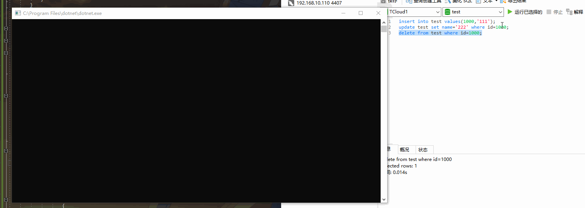

# canal-go                                              |[中文](https://github.com/CanalSharp/canal-go/blob/master/README.zh-cn.md)

## Ⅰ.What is canal-go

canal-go is a golang Client of alibaba's open source component `Canal`,and it provides golang developer a much easier way to use Canal.

 `Cancal` is a incremental Publish&Subscription component based on mysql's `binlog`.To learn more a bout Cancal,please visit ` https://github.com/alibaba/canal/wiki`

 log based incremental pub&sub model  can be applied to  many business cases:

1) Database Mirroring
2) Realtime Database backup
3) Multi-level index
4) search build
5) Busienss cache refresh
6) Notification on price change(in e-commerce site) and so on

## Ⅱ.Using scenarios

`canal-go` as a golang client of canal,it can be used in situations where Canal is being used.We have listed some using scenarios above,here are some more detailed use cases:

1) As a substitution of polling Database to monitor Database changes,it is much more effective than polling.

2) Realtime Update data in search engine when data in mysql database changed.For example,in a E-commerce site,when Product information changed,it can be updated to Elasticsearch、solr,etc in a realtime way.

3) Realtime update data in cache,Also take E-commerce site as an example,when price,inventory and other product information changed,it can be updated to Redis in a realtime way.

4) Database Backup,synchronization.

5) To trigger some other business logics on data change,for example,when a customer place an order without payment in a certain period of time and so the order is cancelled automatically,we get the changed status of the order and then we can push a notification to the customer(or take some other actions)

6) Push changed data to RabbitMq,kafak or other message queues for consuming.

## Ⅲ.Working  mechanism

As a golang client of Canal,it use `Socket` for communication,the transfer Protocol is `TCP`,and the data exchange Protocol is Google's Protocol Buffer 3.0

## Ⅳ.Workflow

1) Canal connect to Mysql database ,pretented to be a slave of mysql

2) CanalSharp(as mentioned it is a client of Cancal) connect to Canal

3) When data in the database changed,it write the changes to binlog

4) Canal send dump request to mysql database,get binlog and then parse it.

5) CancalSharp send request to Canal for data.

6) Canal send parsed data to CanalSharp

7) CancalSharp get data successfully and then send an acknowledgement to Canal(optional)

8) Canal record the consumption position

The following picture shows how it works:


## Ⅴ.Quick Start

### 1. Install Canal

To Install and configure Canal,please visit `https://github.com/alibaba/canal/wiki/QuickStart` for information

### 2.Create a golang Console Project

### 3. Install go get  from github source

````shell
go get  github.com/CanalSharp/canal-go
````

or you can install it from nuget manager(a graphic ui)  in visual studio

### 4. Connect to Canal


````golang
package main

import (
	"canal-go/client"
)

func main() {

	connector := client.NewSimpleCanalConnector("127.0.0.1", 11111, "", "", "example", 60000, 60*60*1000)
	connector.Connect()
	connector.Subscribe(".*\\\\..*")
}

````

for more detailed information please visit [Sample](https://github.com/CanalSharp/canal-go/tree/master/samples)

## Ⅵ Run canal-go via Docker quickly

### 1. Run mysql and canal by command

````shell
git clone https://github.com/CanalSharp/canal-go.git
cd canal-go
cd docker
docker-compose up -d
````

### 2. Use navicat or orther  client to connect to mysql

ip：the ip address of the server where docker running

mysql username：root

mysql password：000000

mysql port：4406

There is a default database named `test`,which contains a table named `test`


### 3.run the sample project

### 4.Test it

Execute the following sql:

````sql
insert into test values(1000,'111');
update test set name='222' where id=1000;
delete from test where id=1000;
````



we can see that after executing `insrt,update,delete` sql,Our CanalSharp get the changed data.


## Ⅶ What we will do next

CanalSharp clustering support

## Ⅷ Contribute

We gladly accept community contributions.

1.fork the CanalSharp Project

2.make changes to it

3.make a pull request

Please do not hesitate to make a pull request,your effort will not in vain.
