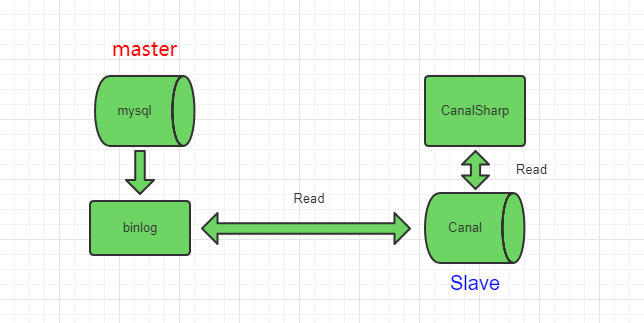
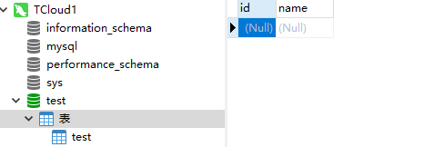

# canal-go

[](https://travis-ci.org/withlin/canal-go)
[](https://goreportcard.com/badge/github.com/withlin/canal-go)

## 一.canal-go是什么?

canal-go (完全兼容java客户端)  是阿里巴巴开源项目 Canal 的 golang 客户端。为 golang 开发者提供一个更友好的使用 Canal 的方式。Canal 是mysql数据库binlog的增量订阅&消费组件。

基于日志增量订阅&消费支持的业务：

1. 数据库镜像
2. 数据库实时备份
3. 多级索引 (卖家和买家各自分库索引)
4. search build
5. 业务cache刷新
6. 价格变化等重要业务消息

关于 Canal 的更多信息请访问 https://github.com/alibaba/canal/wiki

## 二.应用场景

canal-go作为Canal的客户端，其应用场景就是Canal的应用场景。关于应用场景在Canal介绍一节已有概述。举一些实际的使用例子：

1.代替使用轮询数据库方式来监控数据库变更，有效改善轮询耗费数据库资源。

2.根据数据库的变更实时更新搜索引擎，比如电商场景下商品信息发生变更，实时同步到商品搜索引擎 Elasticsearch、solr等

3.根据数据库的变更实时更新缓存，比如电商场景下商品价格、库存发生变更实时同步到redis

4.数据库异地备份、数据同步

5.根据数据库变更触发某种业务，比如电商场景下，创建订单超过xx时间未支付被自动取消，我们获取到这条订单数据的状态变更即可向用户推送消息。

6.将数据库变更整理成自己的数据格式发送到kafka等消息队列，供消息队列的消费者进行消费。

## 三.工作原理

canal-go  是 Canal 的 golang 客户端，它与 Canal 是采用的Socket来进行通信的，传输协议是TCP，交互协议采用的是 Google Protocol Buffer 3.0。

## 四.工作流程

1.Canal连接到mysql数据库，模拟slave

2.canal-go与Canal建立连接

2.数据库发生变更写入到binlog

5.Canal向数据库发送dump请求，获取binlog并解析

4.canal-go向Canal请求数据库变更

4.Canal发送解析后的数据给canal-go

5.canal-go收到数据，消费成功，发送回执。（可选）

6.Canal记录消费位置。

以一张图来表示：



## 五.快速入门

### 1.安装Canal

Canal的安装以及配置使用请查看 https://github.com/alibaba/canal/wiki/QuickStart


### 2.安装

````shell

git clone https://github.com/withlin/canal-go.git

export GO111MODULE=on

go mod vendor

````

### 3.建立与Canal的连接

````golang

connector := client.NewSimpleCanalConnector("192.168.199.17", 11111, "", "", "example", 60000, 60*60*1000)
	err :=connector.Connect()
	if err != nil {
		log.Println(err)
		os.Exit(1)
	}
	err = connector.Subscribe(".*\\\\..*")
	if err != nil {
		log.Println(err)
		os.Exit(1)
	}

	for {

		message,err := connector.Get(100, nil, nil)
		if err != nil {
			log.Println(err)
			os.Exit(1)
		}
		batchId := message.Id
		if batchId == -1 || len(message.Entries) <= 0 {
			time.Sleep(300 * time.Millisecond)
			fmt.Println("===没有数据了===")
			continue
		}

		printEntry(message.Entries)

	}
````

更多详情请查看 [Sample](https://github.com/CanalSharp/canal-go/tree/master/samples)

## 六.通过docker方式快速运行canal-go

### 1.执行命令通过docker方式运行 mysql与canal

````shell
git clone https://github.com/CanalClient/canal-go.git
cd canal-go
cd docker
docker-compose up -d
````

### 2.使用navicat等数据库管理工具连接mysql

ip：运行docker的服务器ip

mysql用户：root

mysql密码：000000

mysql端口：4406

默认提供了一个test数据库，然后有一张名为test的表。



### 3.运行Sample项目

### 4.测试

执行下列sql:

````sql
insert into test values(1000,'111');
update test set name='222' where id=1000;
delete from test where id=1000;
````


可以看见我们分别执行 insert、update、delete 语句，我们的canal-go都获取到了数据库变更。


## 八.贡献代码

1.fork本项目

2.做出你的更改

3.提交 pull request
